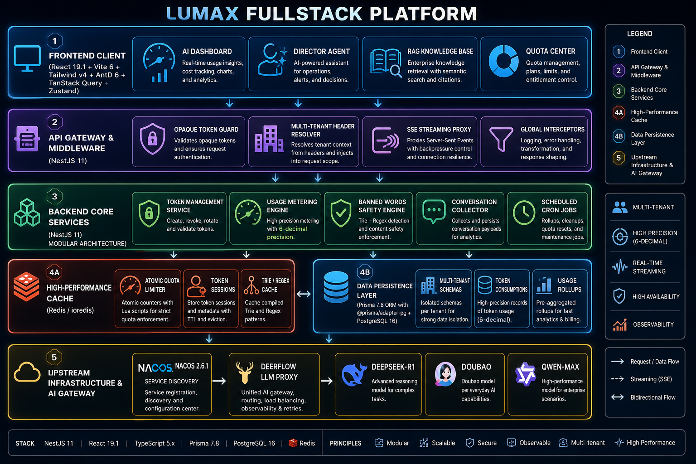
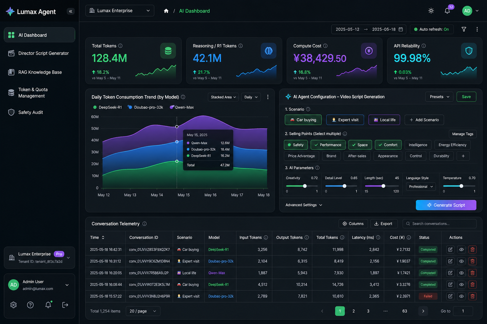

# Lumax — Multi-Tenant AI Gateway Platform

[](https://github.com/Ghostisme/nestjs-prisma-api-gateway/actions/workflows/ci.yml)
[](https://nestjs.com)
[](https://prisma.io)
[](https://postgresql.org)
[](https://redis.io)
[](https://react.dev)
[](https://typescriptlang.org)
[](LICENSE)

> **A production-grade, multi-tenant AI gateway platform** — a NestJS API gateway
> + core services with opaque-token auth, per-tenant isolation, high-precision
> usage metering, Redis-backed quota limiting, a content-safety engine, and
> scheduled jobs; fronted by a React 19 analytics dashboard.



---

## What this solves

Anyone can wrap an LLM call behind an HTTP route. What actually matters when you
put an AI product in front of real, paying tenants is the **gateway layer around
the model**: who is calling, which tenant they belong to, how much they've used,
whether they're over quota, whether the content is allowed, and what it all costs.

Lumax is that layer. It sits between your clients and your model/backend services
and handles authentication, tenant isolation, metering, quota enforcement, content
safety, and observability — then surfaces all of it in a real-time dashboard.

| Concern | How Lumax handles it |
|---------|----------------------|
| **Who is calling** | Opaque-token auth (`OpaqueTokenGuard`) validated against Redis — central revocation, no stateless-JWT footguns |
| **Which tenant** | Per-tenant / per-org isolation carried through every request and query |
| **How much they used** | High-precision usage metering with token-level accounting and periodic rollups |
| **Are they over quota** | Redis-backed quota management with hard limits and increase/decrease operations |
| **Is the content allowed** | Banned-words / content-safety filter backed by a Redis-cached dictionary |
| **What does it cost** | Cost analytics per model/tenant surfaced live in the dashboard |

---

## Business applications

This architecture applies directly if you're building:

- **An AI SaaS with tenants and plans** — meter usage, enforce quotas, bill per tenant.
- **An internal AI gateway** — one controlled entry point in front of many model/backend services, with auth, rate/quota limiting, and audit.
- **A cost-governed LLM platform** — real-time token accounting and cost dashboards so spend never surprises you.
- **A compliance-sensitive AI product** — a content-safety layer and full request auditing baked into the gateway.

---

## Engineering highlights

Four decisions that separate this from a CRUD demo:

1. **Opaque tokens over stateless JWT.** Auth is a `NestGuard` that resolves an
   opaque token against Redis (`server/src/common/guards/opaque-token.guard.ts`).
   That buys instant revocation and per-tenant context without trusting a
   self-signed payload.

2. **A uniform API envelope.** A global exception filter + response interceptor
   (`common/filters`, `common/interceptors`) mean every endpoint returns the same
   `{ code, message, data }` shape — successes and business errors alike — so the
   frontend never special-cases transport quirks.

3. **Metering as a first-class module.** Usage metering and token management are
   dedicated modules with their own unit tests (`*.service.spec.ts`), not an
   afterthought bolted onto request logging.

4. **Versioned SQL alongside Prisma.** The schema is Prisma-managed, but the repo
   also ships explicit, ordered SQL migrations (`database/scripts/V001…V010`)
   including indexes, constraints, and triggers — the way real teams ship DB changes.

---

## Architecture

```
┌───────────────────────────────────────────────────────────┐
│  React 19 + Vite + AntD — web/                              │
│  • Real-time token / cost analytics dashboard               │
│  • TanStack Query server state · Zustand client state       │
│  • RBAC, quota mgmt, RAG knowledge base, safety audit       │
└───────────────────────────┬───────────────────────────────┘
                            │  REST (/api)  ·  Swagger/OpenAPI
┌───────────────────────────▼───────────────────────────────┐
│  NestJS 11 API Gateway + Core Services — server/            │
│  ┌─────────────────────────────────────────────────────┐   │
│  │ OpaqueTokenGuard    Redis-backed opaque-token auth    │   │
│  │ Usage Metering      high-precision token accounting   │   │
│  │ Token Management    quota limits + increase/decrease  │   │
│  │ Banned-words        Redis-cached content-safety filter│   │
│  │ Scheduler           @nestjs/schedule cron rollups     │   │
│  │ Proxy               upstream gateway passthrough      │   │
│  └─────────────────────────────────────────────────────┘   │
└───────────────┬───────────────────────────┬───────────────┘
                │                           │
      ┌─────────▼─────────┐        ┌────────▼────────┐
      │ PostgreSQL 16     │        │ Redis (ioredis) │
      │ Prisma 7.8 +      │        │ tokens · cache  │
      │ adapter-pg        │        │ quota · dict    │
      │ per-tenant data   │        └─────────────────┘
      └───────────────────┘
```

---

## Tech stack

**Backend:** NestJS 11 · TypeScript 5 · Prisma 7.8 (`@prisma/adapter-pg`) · PostgreSQL 16 · Redis / ioredis · `@nestjs/schedule` · `@nestjs/swagger` · Nacos (optional)
**Frontend:** React 19 · Vite 6 · Ant Design 6 · Tailwind CSS 4 · TanStack Query 5 · Zustand · React Router 7 · ApexCharts / D3
**Tooling:** pnpm · Docker · GitHub Actions CI/CD (Jenkins pipeline also included) · PM2 · Biome / ESLint · Jest

---

## Dashboard



Real-time AI operations console: token consumption trends by model, compute cost,
API reliability, per-conversation telemetry, and an AI agent configuration panel.

---

## Quick start

Prerequisites: Node 20+, pnpm, PostgreSQL 16, Redis.

### 1. Backend

```bash
cd server
pnpm install
cp .env.example .env                 # set DATABASE_URL / Redis / etc.
pnpm prisma:generate
pnpm prisma:migrate                  # or apply database/scripts/V001…V010
pnpm run start:dev                   # http://localhost:9008
```

Swagger UI: `http://localhost:9008/api-docs`. Set `AUTH_MOCK=true` for local dev.

### 2. Frontend

```bash
cd web
pnpm install
cp .env.example .env.development
pnpm dev                             # http://localhost:3001
```

The dev server proxies `/api` → the NestJS gateway.

---

## Project structure

```
nestjs-prisma-api-gateway/
├── server/                     # NestJS 11 API gateway + core services
│   ├── src/
│   │   ├── main.ts             # bootstrap, global pipes/filters, Swagger
│   │   ├── app.module.ts       # module wiring (23 feature modules)
│   │   ├── common/             # guards, filters, interceptors, dto, utils
│   │   ├── modules/            # auth, usage-metering, token-management, …
│   │   └── prisma/             # Prisma service + module
│   ├── prisma/schema.prisma    # data model (per-tenant)
│   ├── database/scripts/       # ordered SQL migrations V001…V010
│   ├── Dockerfile · Jenkinsfile · .github/workflows/ci.yml
│   └── README.md
├── web/                        # React 19 + Vite dashboard
│   ├── src/{api,pages,components,layouts,routes,store,theme,ui}
│   ├── docs/frontend-design-specification.md
│   └── README.md
└── docs/                       # architecture + dashboard assets
```

---

## Deployment

See [DEPLOY.md](DEPLOY.md) for Dockerized backend deployment (GitHub Actions CI, with a Jenkins + PM2 pipeline also provided),
Nginx static hosting for the frontend, and notes on Railway / Render / Supabase.

---

## License

MIT — see [LICENSE](LICENSE).
